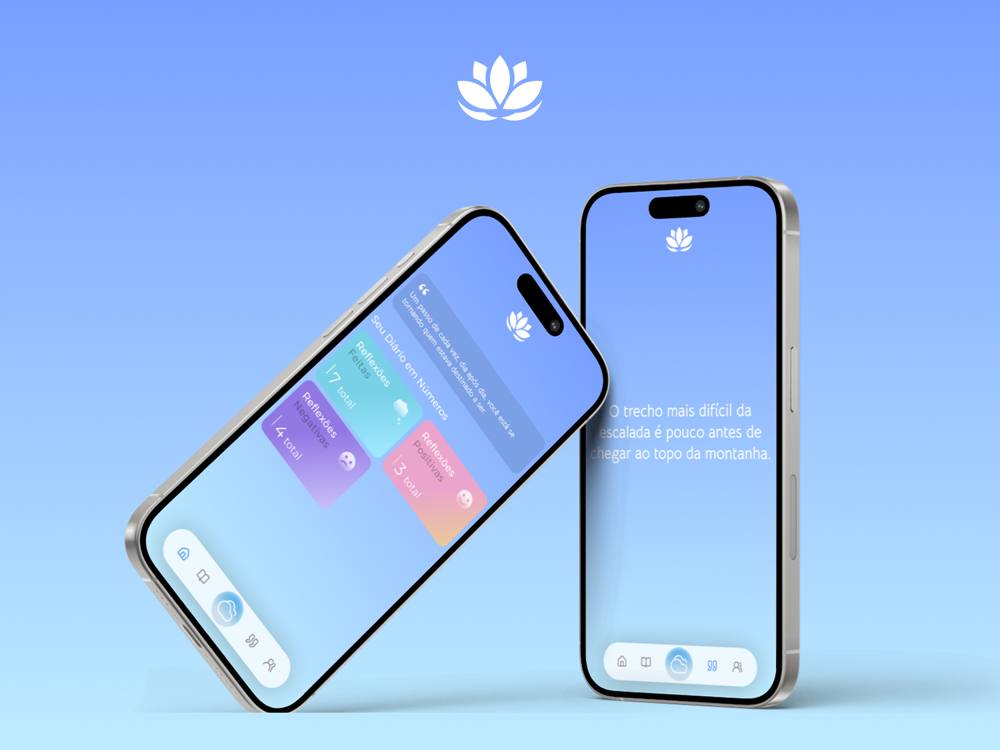

# 📱 OTIUM



## 🚀 Instalando dependências

Para instalar as dependências do projeto siga estas etapas:

- Baixe o repositório
- Abra o terminal e digite o comando:

``` bash
npm install
```

## ☕ Executando o projeto

Para executar o projeto, siga estas etapas:

``` bash
npx expo start
```

> Caso possua o Android Studio instalado e configurado em sua máquina, basta digitar `a` no terminal para abrir um dispositivo Android.

> Caso não possua, instale o Expo Go em seu smartphone e escaneie o QR Code gerado no terminal que será exibido em seu smartphone (necessário que o PC e Smartphone estejam na mesma rede).

## 🤝 Colaboradores

Agradecemos às seguintes pessoas que contribuíram para este projeto:

<table>
  <tr>
    <td align="center">
      <a href="https://github.com/edvxndxvi">
        <br>
        <sub>
          <b>Edvan Davi</b>
        </sub>
      </a>
    </td>
    <td align="center">
      <a href="https://github.com/rafaelromanini">
        <br>
        <sub>
          <b>Rafael Romanini</b>
        </sub>
      </a>
    </td>
    <td align="center">
      <a href="https://github.com/Fernando1211">
        <br>
        <sub>
          <b>Fernando Aguiar</b>
        </sub>
      </a>
    </td>
  </tr>
</table>


